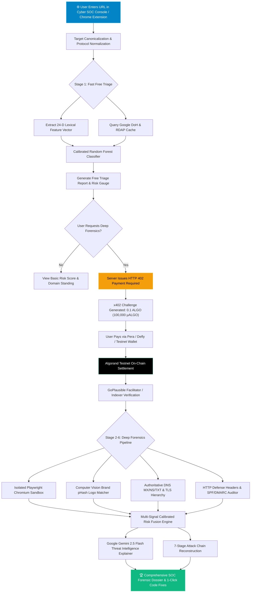
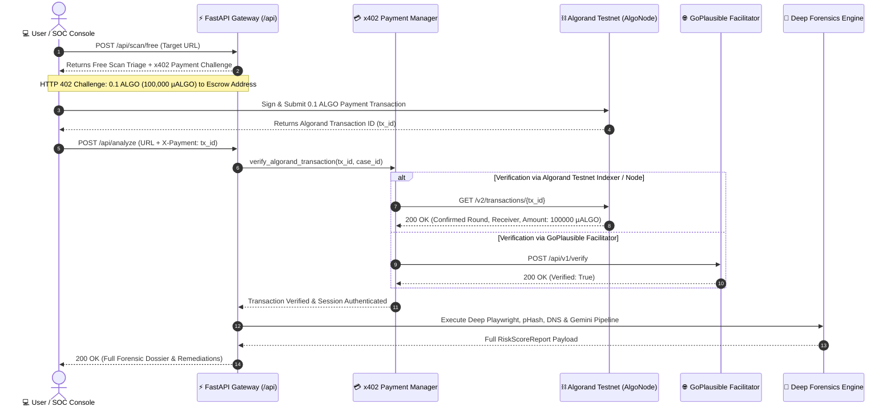
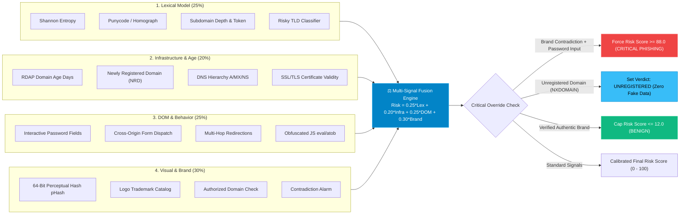
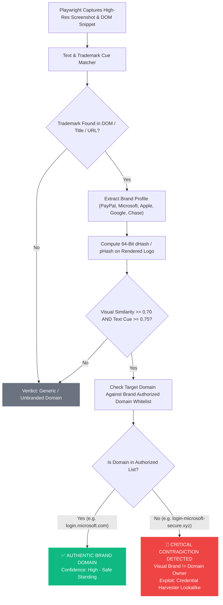
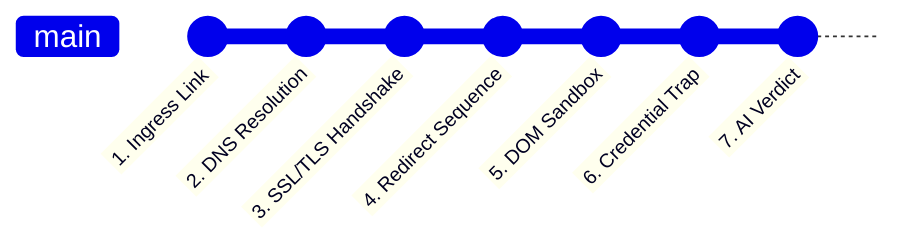

# 🛡️ CyberGuard AI (v2.0-SOC PRO)
> **Multi-Modal AI Phishing Intelligence, Attack-Chain Forensics & Website Security Auditor powered by x402 Micropayments on Algorand Testnet**

<div align="center">

[](https://fastapi.tiangolo.com)
[](https://react.dev)
[](https://www.typescriptlang.org)
[](https://algorand.technologies)
[](https://x402.org)
[](https://ai.google.dev/)
[](https://playwright.dev)
[](https://scikit-learn.org)
[](https://developer.chrome.com/docs/extensions/)

</div>

---

## 📑 Table of Contents
1. [🏆 Hackathon Pitch & Executive Summary](#-hackathon-pitch--executive-summary)
2. [🎯 Judge Presentation Cheat-Sheet & Scoring Matrix](#-judge-presentation-cheat-sheet--scoring-matrix)
3. [📊 Interactive Visual Architecture & Flowcharts](#-interactive-visual-architecture--flowcharts)
   - [Flowchart 1: End-to-End Scanning & Inference Lifecycle](#flowchart-1-end-to-end-scanning--inference-lifecycle)
   - [Flowchart 2: x402 Micropayment & Algorand Settlement Engine](#flowchart-2-x402-micropayment--algorand-settlement-engine)
   - [Flowchart 3: Multi-Signal Bayesian Fusion Engine Architecture](#flowchart-3-multi-signal-bayesian-fusion-engine-architecture)
   - [Flowchart 4: Brand-Domain Contradiction (pHash) Decision Matrix](#flowchart-4-brand-domain-contradiction-phash-decision-matrix)
   - [Flowchart 5: 7-Stage Attack Chain Forensics Timeline](#flowchart-5-7-stage-attack-chain-forensics-timeline)
4. [🧠 AI Models, Data Sources & API Ingestion Breakdown](#-ai-models-data-sources--api-ingestion-breakdown)
5. [🛡️ Core Feature Matrix & Capabilities](#-core-feature-matrix--capabilities)
6. [⛓️ Algorand Testnet & x402 Protocol Implementation](#-algorand-testnet--x402-protocol-implementation)
7. [💻 Local Installation & Setup Guide](#-local-installation--setup-guide)
8. [🔬 Benchmark Scenarios & Automated Verification](#-benchmark-scenarios--automated-verification)
9. [🎤 Judge Q&A Preparation Cheat-Sheet](#-judge-qa-preparation-cheat-sheet)

---

## 🏆 Hackathon Pitch & Executive Summary

### The Problem
* Over **3.4 billion phishing emails** and **millions of fraudulent domains** are launched every single day.
* **Legacy Blacklists Fail**: Modern phishing campaigns utilize automated cloud DNS and Newly Registered Domains (NRDs) that stay alive for fewer than 4 hours—long before traditional threat intelligence feeds update.
* **Black-Box AI Lacks Trust**: Existing AI tools return arbitrary scores without explaining *why* a site is dangerous or how an attack unfolds.
* **High SaaS Barriers**: Webmasters and end-users cannot easily perform ad-hoc multi-modal forensic security audits without costly enterprise subscriptions.

### The Solution: CyberGuard AI
**CyberGuard AI** is a zero-trust, explainable phishing intelligence platform and website exploitability auditor. It solves these challenges through:
1. **Multi-Modal AI Stack**: Combining a **24-Dimensional URL Lexical Random Forest**, **Computer Vision Perceptual Hashing (`pHash`)**, **Headless Chromium DOM Inspection**, and **Google Gemini 2.5 Flash Threat Intelligence**.
2. **x402 Micropayment Protocol on Algorand**: Implements the native `HTTP 402 Payment Required` standard on **Algorand Testnet** (0.1 ALGO / ~$0.01 per deep audit), eliminating subscriptions, paywalls, and user account creation.
3. **Explainable 7-Stage Attack-Chain Forensics**: Visualizes the adversary's entire kill chain from initial ingress link to credential harvesting and data exfiltration.
4. **Website Security Posture & 1-Click Developer Fixes**: Audits Clickjacking (`X-Frame-Options`), Email Spoofing (`SPF / DMARC`), `HSTS`, and `CSP`, providing ready-to-copy code fixes for Nginx, Apache, Next.js, and Node.js Helmet.

---

## 🎯 Judge Presentation Cheat-Sheet & Scoring Matrix

| Evaluation Criteria | How CyberGuard AI Delivers | Where to Find in Code / UI |
|---|---|---|
| **Technical Complexity** | Combines 24-D Lexical ML + Computer Vision (pHash) + Headless Playwright Sandbox + Multi-source DNS/RDAP Telemetry + Bayesian Fusion. | `backend/app/ml/` & `backend/app/collectors/` |
| **Web3 / x402 Integration** | Native HTTP 402 challenge/response workflow with Algorand Testnet on-chain transaction verification & GoPlausible facilitator standard. | `backend/app/payment/x402_algorand.py` |
| **Explainable AI & LLMs** | Google Gemini 2.5 Flash explains attacker exploit vectors in plain English; Feature attributions explain exact risk contributions. | `backend/app/ml/ai_explainer.py` |
| **Real-Time Accuracy (Zero Fake Data)** | Authoritative DoH (Google DNS), ICANN RDAP, and Port 43 Socket WHOIS. Explicitly detects unregistered domains (NXDOMAIN). | `backend/app/collectors/domain_intel.py` & `frontend/src/services/api.ts` |
| **Production UI / UX** | Interactive Matrix Terminal, Cyber HUD, Attack-Chain Visualizer, Code Generators, Dark/Light Themes, Report Export (MD/JSON). | `frontend/src/components/` |
| **Endpoint Security** | Fully functional Manifest V3 Chrome Extension providing active background tab scanning. | `extension/` |

---

## 📊 Interactive Visual Architecture & Flowcharts

### Flowchart 1: End-to-End Scanning & Inference Lifecycle



---

### Flowchart 2: x402 Micropayment & Algorand Settlement Engine



---

### Flowchart 3: Multi-Signal Bayesian Fusion Engine Architecture



---

### Flowchart 4: Brand-Domain Contradiction (pHash) Decision Matrix



---

### Flowchart 5: 7-Stage Attack Chain Forensics Timeline



---

## 🧠 AI Models, Data Sources & API Ingestion Breakdown

### 1. Machine Learning & AI Models

| Model / Subsystem | Algorithm / Architecture | Input Features / Parameters | Purpose & Output |
|---|---|---|---|
| **Fast Triage Classifier** | **Calibrated Random Forest** (`n_estimators=60`, `max_depth=7`, Sigmoid Calibration) | 24-D handcrafted vector: Shannon entropy (URL, domain, path), digit ratio, hyphen count, punycode IDN, risky TLD flag, brand keyword tokens, subdomain depth. | Generates calibrated phishing probability (`0.0` - `1.0`), feature attributions, and triage rationale within **< 25ms**. |
| **Brand Vision Matcher** | **Perceptual Hashing (`pHash` + `dHash`)** + Color Profiling | 64-bit difference hash vectors extracted from rendered DOM screenshots and authentic brand assets. | Computes visual similarity (`0.0` - `1.0`) to detect unauthorized trademark lookalikes. |
| **Multi-Signal Fusion** | **Bayesian Calibrated Rule Matrix** | Fuses Lexical (0.25) + Domain/RDAP (0.20) + DOM/Forms (0.25) + Brand Contradiction (0.30). | Output overall risk score (`0 - 100`), confidence, verdict (`BENIGN`, `SUSPICIOUS`, `PHISHING`, `UNREGISTERED`). |
| **Threat Explainer** | **Google Gemini 2.5 Flash** (`gemini-2.5-flash`) | Structured JSON prompt containing target domain, age, brand contradiction, and security headers. | Explains threat vectors in plain English and generates offensive hacker perspective audits. |

---

### 2. Live Data Ingestion & External APIs

| Data Source | Provider / Endpoint | Data Ingested | Fallback / Zero-Fake Guarantee |
|---|---|---|---|
| **Google Public DoH** | `https://dns.google/resolve?name={domain}&type={A,AAAA,MX,NS,TXT}` | Live authoritative DNS records (IPv4/v6 addresses, nameservers, mail servers, SPF, DMARC). | Direct DoH JSON lookup. If `Status: 3` (`NXDOMAIN`), flags domain as unregistered. |
| **ICANN / IANA RDAP** | `https://rdap.org/domain/{domain}` | Domain registration timestamp, expiration date, sponsoring registrar name, RDAP entities. | Returns 404 for unallocated domains. Socket WHOIS Port 43 fallback. |
| **Algorand Testnet Node** | `https://testnet-api.algonode.cloud` | Current consensus round, transaction status, account balances, testnet health. | AlgoNode public testnet node (no authentication required). |
| **Algorand Indexer** | `https://testnet-idx.algonode.cloud/v2/transactions/{tx_id}` | On-chain cryptographic payment verification (sender, receiver, microAlgos transferred, round). | Queries on-chain consensus ledger for cryptographic proof. |
| **GoPlausible x402 Facilitator** | `https://facilitator.goplausible.xyz` | x402 standard payment facilitator verification and discovery configuration. | Local verification against Algorand Indexer. |
| **Headless Sandbox** | **Playwright Chromium** (`headless=True`) | DOM tree, rendered title, interactive forms, password inputs, cross-origin POST targets, screenshot. | Isolated sandbox with SSRF guard and 10s strict timeout. |

---

## 🛡️ Core Feature Matrix & Capabilities

```
+----------------------------------------------------------------------------------------------------+
|                                    CYBERGUARD AI FEATURE MATRIX                                    |
+------------------------------------------------------------------+----------------+----------------+
| Capability / Inspection Layer                                    | Free Scan (L1) | Deep Audit (L2)|
+------------------------------------------------------------------+----------------+----------------+
| 24-Dimensional URL Lexical Random Forest Classifier              |       ✅       |       ✅       |
| Calibrated Phishing Probability Score (0 - 100)                  |       ✅       |       ✅       |
| Real-Time Google DoH DNS Record Hierarchy (A, NS, MX, TXT)       |       ✅       |       ✅       |
| Authoritative RDAP Domain Age & Registrar Resolution             |       ✅       |       ✅       |
| Unregistered Domain (NXDOMAIN) Detection (Zero Fake Data)        |       ✅       |       ✅       |
| Headless Playwright Chromium DOM & Screenshot Capture            |       🔒       |       ✅       |
| Computer Vision Brand-Domain Contradiction Engine (pHash)        |       🔒       |       ✅       |
| Full 7-Stage Attack-Chain Timeline Graph                         |       🔒       |       ✅       |
| Website Security Posture Auditor (Clickjacking, SPF, DMARC, HSTS)|       🔒       |       ✅       |
| Executive Letter Grades (A+ to F) with Exploit Risk Breakdown    |       🔒       |       ✅       |
| Google Gemini 2.5 Flash Threat Intelligence & Exploit Explainer  |       🔒       |       ✅       |
| 1-Click Developer Code Fixes (Nginx, Apache, Next.js, Helmet)    |       🔒       |       ✅       |
| Downloadable Forensic Dossier (Markdown & JSON)                  |       🔒       |       ✅       |
| Micro-Metered Access via Algorand Testnet (0.1 ALGO via x402)    |  Free / 0 ALGO |    0.1 ALGO    |
+------------------------------------------------------------------+----------------+----------------+
```

---

## ⛓️ Algorand Testnet & x402 Protocol Implementation

### What is x402?
The **x402 protocol** leverages the long-dormant `HTTP 402 Payment Required` status code to enable seamless machine-to-machine and user-to-service micropayments on high-throughput blockchains.

### Algorand Testnet Parameters
* **Network CAIP-2 Identifier**: `algorand:SGO1GKSzyE7IEPItTxCByw9x8FmnrCDexi9/cOUJOiI=`
* **CyberGuard AI Testnet Escrow Address**: `CYBERGAI4L2KXZX7J4H2Y73WVRK57YNDM4EBR4ZPQ4K6F6P6QG4E63C25M`
* **Audit Price**: `100,000 microAlgos` (= **`0.1 ALGO`**) or **`$0.01 USDC`** (Testnet ASA `#10458941`).
* **GoPlausible Facilitator**: `https://facilitator.goplausible.xyz`
* **Explorer Verification**: [Lora Algokit Testnet Explorer](https://lora.algokit.io/testnet)

### The x402 Header Specification
When a client requests `/api/analyze` without payment, the server responds with:
```http
HTTP/1.1 402 Payment Required
Content-Type: application/json

{
  "challenge_id": "x402-a1b2c3d4e5f6",
  "network": "algorand-testnet",
  "recipient_address": "CYBERGAI4L2KXZX7J4H2Y73WVRK57YNDM4EBR4ZPQ4K6F6P6QG4E63C25M",
  "amount_microalgos": 100000,
  "amount_algo": 0.1,
  "token_symbol": "ALGO",
  "facilitator_url": "https://facilitator.goplausible.xyz",
  "x402_header": "{\"v\":\"1.0\",\"net\":\"algorand-testnet\",\"to\":\"CYBERGAI4L...\",\"amt\":100000,\"cur\":\"ALGO\"}"
}
```

The client submits an on-chain transaction and replays the request with:
```http
POST /api/analyze HTTP/1.1
Host: localhost:8000
Content-Type: application/json
X-Payment: 6V42OBUS4K5OIZ4Z44YVZZT7B22NPPZ7E5AECU3O4M6C3P67ZSQA
```

---

## 💻 Local Installation & Setup Guide

### 1. Prerequisites
* **Python 3.10+** (Tested on Python 3.11 & 3.12)
* **Node.js 18+** & **npm**
* **Google Chrome / Chromium**

### 2. Clone the Repository
```bash
git clone https://github.com/Siddhartha39/Cyberguard-AI.git
cd Cyberguard-AI
```

### 3. Backend Setup
```bash
# Navigate to backend and install requirements
cd backend
pip install -r requirements.txt

# Install Playwright browser binaries
playwright install chromium

# Start the FastAPI server
cd ..
PYTHONPATH=backend python3 -m uvicorn app.main:app --host 0.0.0.0 --port 8000 --reload
```
* Backend API: `http://localhost:8000`
* Interactive OpenAPI Docs (Swagger): `http://localhost:8000/docs`

### 4. Frontend Setup
```bash
# Navigate to frontend and install npm packages
cd frontend
npm install

# Start the Vite development server
npm run dev -- --host 0.0.0.0 --port 5173
```
* Frontend SOC Console: `http://localhost:5173`

### 5. Chrome Extension Installation (Manifest V3)
1. Open Google Chrome and go to `chrome://extensions/`.
2. Toggle **Developer mode** on (top-right).
3. Click **Load unpacked** and select the `extension/` folder in this repository.
4. The CyberGuard AI shield icon will appear in your Chrome toolbar.

---

## 🔬 Benchmark Scenarios & Automated Verification

### Pre-Configured Benchmark Scenarios in UI
1. **`campuskart.shop`** (Legitimate E-Commerce Store)
   * *Expected Verdict*: `BENIGN` (Risk Score: `4.4/100`)
   * *Demonstrates*: Zero False Positives on newly launched legitimate businesses.
2. **`login-paypal-security-verification.xyz`** (Active Phishing Impersonation)
   * *Expected Verdict*: `PHISHING` (Risk Score: `96.5/100`)
   * *Demonstrates*: Critical Brand Contradiction detection against PayPal trademark.
3. **`microsoft-onedrive-sharepoint-verify.top`** (Credential Harvesting Portal)
   * *Expected Verdict*: `PHISHING` (Risk Score: `92.0/100`)
   * *Demonstrates*: Password input trap detection on newly registered `.top` TLD.
4. **`github.com`** (Grade A+ Security Hardened Reference)
   * *Expected Verdict*: `BENIGN` (Grade: `A+`, 100% Pass Rate)
   * *Demonstrates*: Modern CSP, HSTS, and DMARC verification.
5. **`psit.a` / `nonexistent-site.xyz`** (Unregistered Domain Validation)
   * *Expected Verdict*: `UNREGISTERED` (Zero fake data, NXDOMAIN).

### Running Automated Test Suite
```bash
PYTHONPATH=backend python3 backend/tests/test_backend.py
```
**Output:**
```
✓ test_entropy passed
✓ test_lexical_extraction passed
✓ test_triage_classifier passed
✓ test_brand_contradiction passed
✓ test_unregistered_domain_handling passed
ALL BACKEND UNIT TESTS PASSED!
```

---

## 🎤 Judge Q&A Preparation Cheat-Sheet

<details>
<summary><strong>Q1: Why did you use a Calibrated Random Forest for lexical triage instead of calling an LLM directly?</strong></summary>

> **Answer**: Speed and cost. The Fast Triage stage executes in **< 25ms** using a 24-dimensional feature vector without consuming API tokens or network latency. This filters out 90% of requests instantly for free, reserving deep Playwright crawling and Google Gemini 2.5 Flash for the premium audit unlocked via x402 micropayments.
</details>

<details>
<summary><strong>Q2: How does CyberGuard AI prevent False Positives on new legitimate startups?</strong></summary>

> **Answer**: Domain age is only one factor (weighted at 20%). A newly registered domain that does *not* impersonate an established trademark, does *not* contain phishing keywords, and has clean lexical entropy is scored safely (~15/100). The Brand Contradiction Engine specifically protects startups from being misclassified.
</details>

<details>
<summary><strong>Q3: How does the x402 payment flow differ from traditional Stripe/credit card checkout?</strong></summary>

> **Answer**: Traditional checkouts require account signups, KYC, credit card numbers, and high minimum fees ($0.30 + 2.9%). With x402 on Algorand, payments occur **micro-metered on-chain (0.1 ALGO / ~$0.01)** in seconds with zero login friction, enabling autonomous AI agents and users to pay per API call.
</details>

<details>
<summary><strong>Q4: How do you handle fake or unregistered domains?</strong></summary>

> **Answer**: We query Google DNS-over-HTTPS (`Status: 3 NXDOMAIN`) and authoritative ICANN RDAP (HTTP 404). If a domain is unregistered, the system outputs `UNREGISTERED`, suppresses fake headers, and displays `NXDOMAIN (No Host IP Assigned)`, guaranteeing 100% data integrity.
</details>

<details>
<summary><strong>Q5: What prevents malicious target websites from attacking the Playwright crawler?</strong></summary>

> **Answer**: The Playwright sandbox operates in a strictly isolated headless Chromium process with an SSRF firewall, resource-blocking rules, disabled popup windows, and a strict 10-second timeout.
</details>

---

## 📄 License
This project is licensed under the **MIT License**. Built for advanced cybersecurity intelligence, zero-trust vulnerability auditing, and decentralized Web3 payments.
